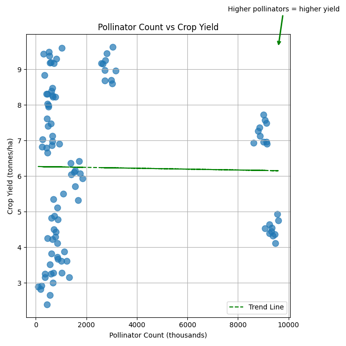
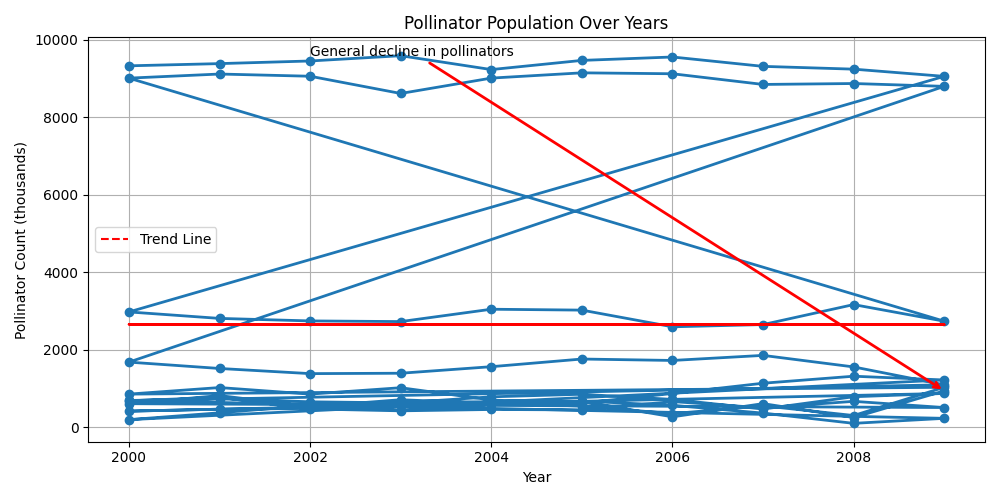
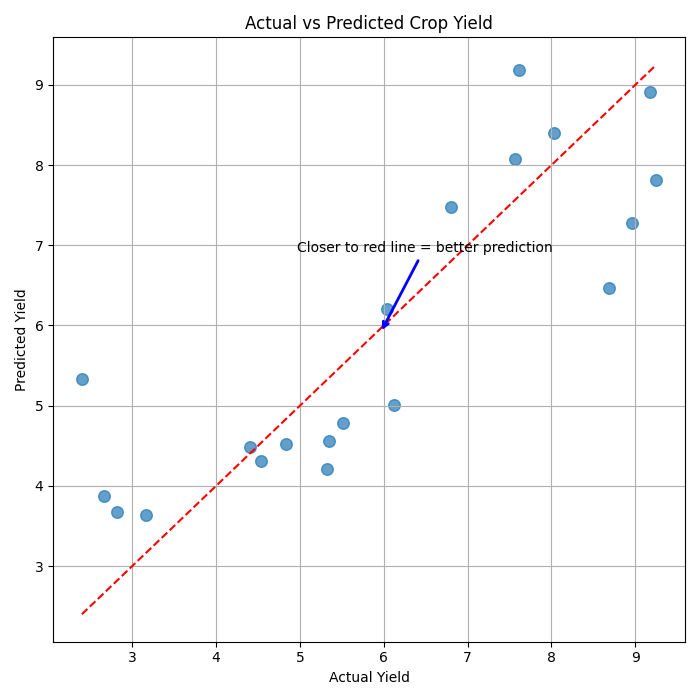

# 🌼 Pollinator Population & Crop Yield Prediction using Machine Learning

<p align="center">
  
</p>

<p align="center">
  <strong>Predicting agricultural crop yield by analyzing pollinator populations using Machine Learning.</strong>
</p>

<p align="center">
  
  
  
  
  
  
  
</p>

---

# 📖 Project Overview

Pollinators such as bees, butterflies, and other insects play a vital role in global agriculture by improving crop pollination and increasing food production. However, declining pollinator populations have become a major environmental concern worldwide.

This project applies **Machine Learning** to analyze the relationship between pollinator populations and agricultural crop yield. Using real-world data, the project performs data preprocessing, exploratory data analysis, feature engineering, regression modeling, and visualization to understand how pollinator activity influences crop production.

---

# 🎯 Objectives

- Analyze pollinator population trends.
- Study the relationship between pollinator abundance and crop yield.
- Build a Machine Learning regression model.
- Predict crop yield using environmental and pollinator-related features.
- Evaluate model performance using regression metrics.
- Visualize important trends and relationships.

---

# 📊 Dataset

The project uses a real-world dataset containing pollinator and agricultural information.

### Dataset includes

- Pollinator Population
- Crop Yield
- Environmental Factors
- Yearly Observations
- Agricultural Metrics

The dataset was cleaned and preprocessed before model training to improve prediction accuracy.

---

# 🛠️ Tech Stack

### Programming Language

- Python

### Libraries

- Pandas
- NumPy
- Scikit-learn
- Matplotlib
- Seaborn

### Environment

- Jupyter Notebook

---

# ⚙️ Workflow

```text
Dataset Collection
        │
        ▼
Data Cleaning
        │
        ▼
Exploratory Data Analysis
        │
        ▼
Feature Engineering
        │
        ▼
Regression Model Training
        │
        ▼
Prediction
        │
        ▼
Performance Evaluation
        │
        ▼
Visualization
```

---

# 📊 Visualizations

## 🌼 Pollinator Population Over the Years

This graph illustrates how pollinator populations have changed over time and highlights long-term ecological trends.

<p align="center">

</p>

---

## 🌾 Pollinator Population vs Crop Yield

Scatter plot showing the relationship between pollinator population and agricultural crop yield.

<p align="center">

</p>

---

## 📈 Actual vs Predicted Crop Yield

Comparison between the model's predictions and the actual crop yield values.

<p align="center">

</p>

---

# 🤖 Model Performance

| Metric | Score |
|---------|------:|
| **R² Score** | **0.8432** |
| **RMSE** | **60.97** |

The regression model achieved an **R² Score of 0.8432**, indicating that it successfully explains approximately **84% of the variation** in crop yield. The obtained RMSE demonstrates good predictive performance on the evaluation dataset.

---

# 🔍 Key Insights

- Pollinator populations have a measurable impact on agricultural productivity.
- Crop yield generally increases with healthier pollinator populations.
- Data visualization helped identify relationships before model training.
- Machine Learning can assist in understanding ecological factors affecting agriculture.
- Feature engineering significantly improved prediction performance.

---

# 📂 Project Structure

```text
ai-project/
│
├── data/
│
├── figures/
│   ├── actual_vs_predicted.png
│   ├── pollinators_over_years.png
│   └── pollinators_vs_yield.png
│
├── notebook.ipynb
├── requirements.txt
├── README.md
└── LICENSE
```

---

# 🚀 Installation

Clone the repository

```bash
git clone https://github.com/kohli30/ai-project.git
```

Move into the project directory

```bash
cd ai-project
```

Install dependencies

```bash
pip install -r requirements.txt
```

Launch Jupyter Notebook

```bash
jupyter notebook
```

---

# 📌 Future Improvements

- Train advanced regression models such as Random Forest and XGBoost.
- Perform hyperparameter tuning.
- Increase dataset size using additional ecological data.
- Deploy the model as a Flask or Streamlit web application.
- Build an interactive dashboard for agricultural insights.

---

# 👨‍💻 Author

**Aditya Kohli**

- GitHub: https://github.com/kohli30
- LinkedIn: https://www.linkedin.com/in/aditya-k-b3812928b/

---

# 📄 License

This project is licensed under the MIT License.

---

## ⭐ Support

If you found this project useful, consider giving it a ⭐ on GitHub!


